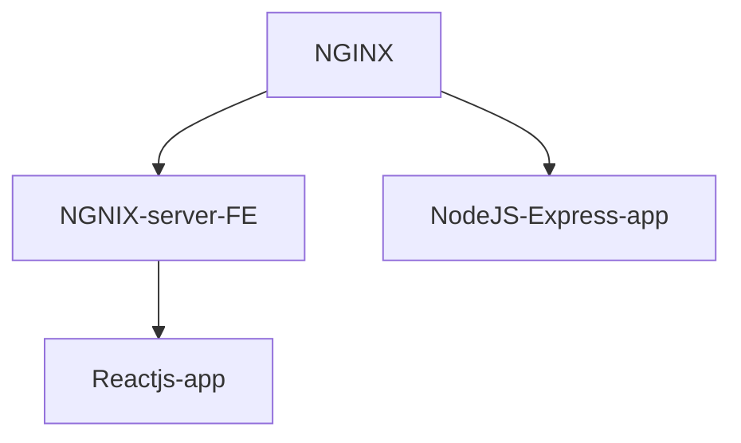

# Books fullstack
Fullstack app (no DB) with Reactjs and Nodejs. Login for users and CRUD for books

This is an application that is bootstraped with ReactJS for the frontend and developed with ExpressJS in NodeJS enviroment for the backend.
An NGINX server is used to serve the static build for the frontend. Also an NGINX server is used as a reverse proxy to access the app.

The architecture of the App is as follows:



To run the App in your local computer you may run:

```javascript
docker-compose build
docker-compose up
```
The app should be served in *localhost:80* (*localhost:3050* if using docker-compose-dev)

The App is deploy in an **AWS** EBS instance in Linux enviroment.
Deployed link --> [books-fullstack](http://booksfull-env.eba-z3e2uzbm.us-east-1.elasticbeanstalk.com/)

A simple CI/CD pipeline is setup with **Github Actions**.


----
Made with ❤ by *Simon Garmendia* in BCN
